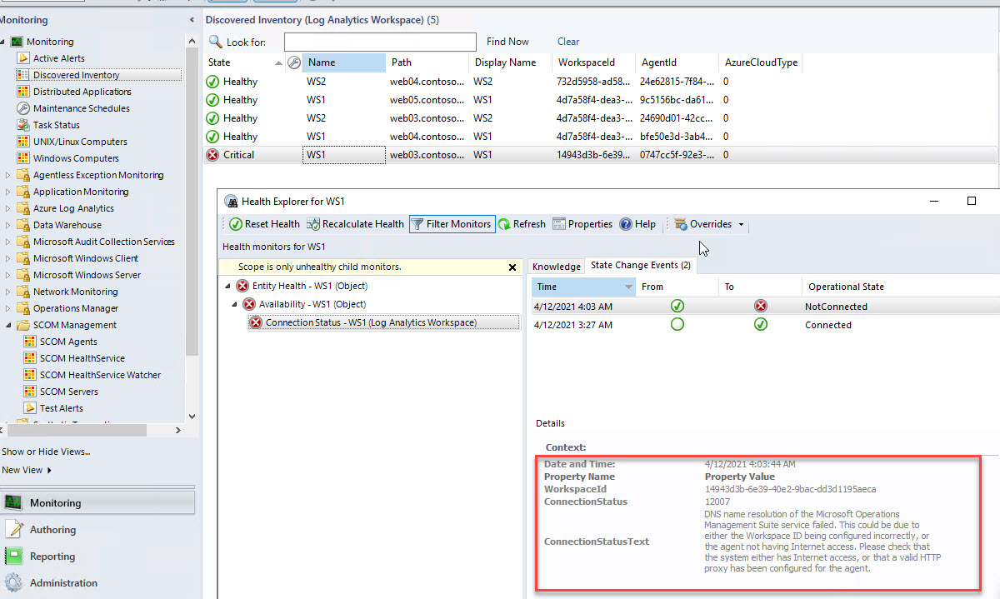
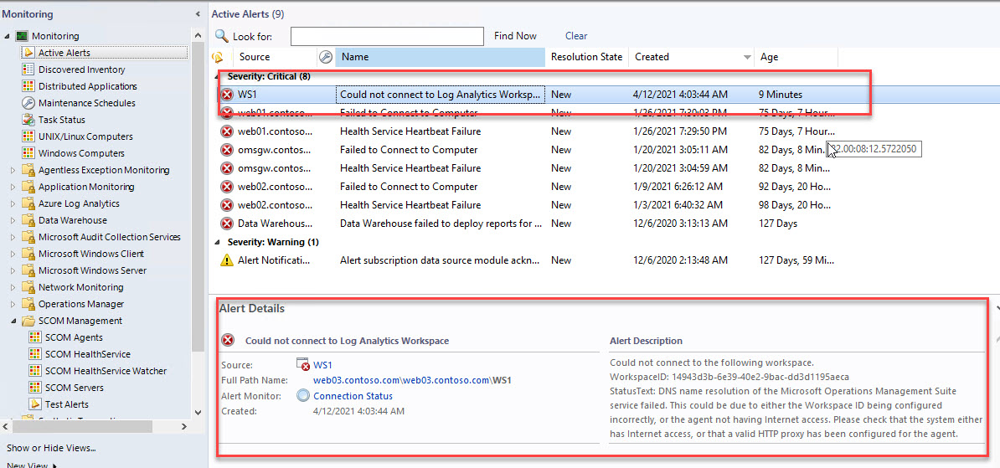

# Monitor LogAnalytics Workspaces using SCOM

Management Pack to monitor Workspaces connection status using SCOM. 

Below is an example screenshot of the healthstate.

An Alert is also generated.

# How to install management pack

Download this file [ManagementPack](./ManagementPack/Scom.LogAnalytics.Workspaces.zip)